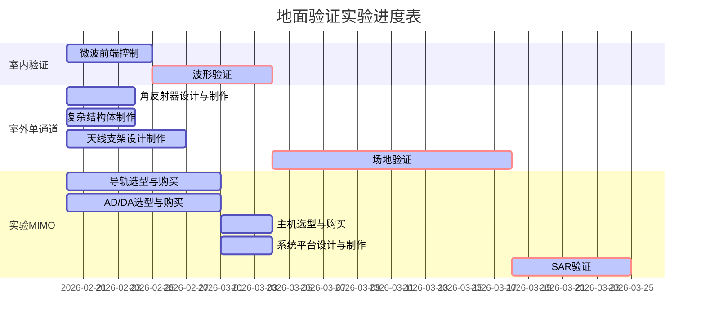

# 新体制连续波地面验证前期汇报

## 实验背景

## 实验目的

## 实验进度

## 地面验证系统

### 设备清单

| 名称 | 数量 | 预算 |
| ---- | ---- | ---- |
|      |      |      |
|      |      |      |
|      |      |      |

### 天线系统（宋）

（一套喇叭天线的，一套阵列天线的）
喇叭天线型号：HD-100SGAH20N
工作频率   ：8.2-14GHz
标准增益   ：20dB      
E面波束宽度：11-19°      
H面波束宽度：13-19°        
外形尺寸   :138×107×245mm   
材料       :铝材
数量       ：2

X波段（9.6GHz），最大带宽2GHz
系统采用连续波工作模式，发射4通道，接收4通道
采用平板天线结构，收发天线之间隔离度优于129dB
天线各通道之间接口采用SMA
单通道最大功率≤5w
采用一个机械机构将收发天线集成在一起
极化：水平极化
单通道俯仰向波束宽度23︒~27︒
单通道方位向波束宽度28︒~32︒
尺寸420mm×1200mm

### 微波+AD系统
微波前端
发射功率步进调整（衰减/增益）步进衰减范围 0-30dB
4通道选通，多种发射/接收模式
发射/接收带宽可选（0.3GHz/0.6GHz/1.2GHz)
中频频率：1.2GHz
中频带宽：1.2GHz
射频频率：9.6GHz
射频带宽：1.2GHz

### 主机系统（颜）

### 供电系统(宋)
微波前端的电源需求为28V直流电(接收通道最大不损坏功率40w) 需要电源模块
导轨 电源
主机220V 功率约为600-700w

锂电池移动电源 最高额定功率型号1500w  自带灯板 尺寸190×320×190mm 1960wh 158万mAh 定价2000元 充电时间6-8小时 10kg
小型发电机     额定功率3kw以上 25kg+5L油箱 额定电流10.8A 尺寸480×290×440mm

### 结构系统（颜）

### 运动系统（刘）

### 靶标系统（颜）

