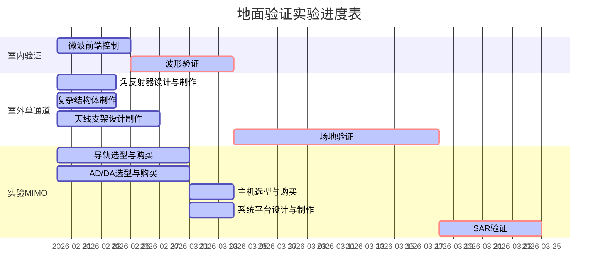

# 新体制连续波地面验证前期汇报

## 实验背景

## 实验目的

## 实验进度

## 地面验证系统

### 设备清单

| 名称 | 数量 | 预算 |
| ---- | ---- | ---- |
|      |      |      |
|      |      |      |
|      |      |      |

### 天线系统（宋）

（一套喇叭天线的，一套阵列天线的）
喇叭天线型号：HD-100SGAH20N
|  工作频率   | 8.2-14GHz|
|  标准增益   | 20dB   | 
| E面波束宽度 | 11-19° |      
| H面波束宽度 | 13-19° |      
|  外形尺寸   | 138×107×245mm|     
|  材料       | 铝材  | 

### 微波+AD系统

### 主机系统（颜）

### 供电系统(宋)

### 结构系统（颜）

### 运动系统（刘）

### 靶标系统（颜）

